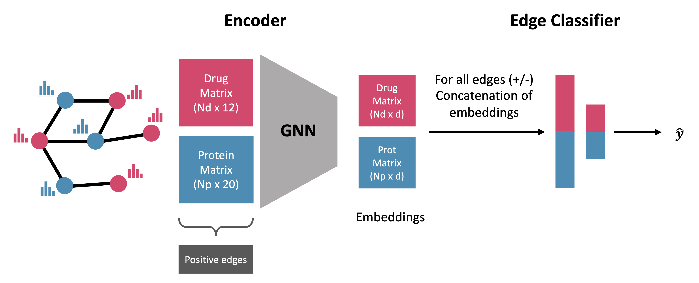

# GeNNius
GeNNius: An ultrafast drug-target interaction inference method based on graph neural networks


Motivation: Drug-target interaction (DTI) prediction is a relevant but challenging task in the field of drug discovery. In-silico approaches have drawn special attention as they can reduce the associated costs and time commitment of traditional methodologies. Yet, current state-of-the-art methods present several limitations: (1) existing DTI prediction approaches are highly computationally expensive preventing from using large networks and leveraging large available data sets; (2) generalization to unseen DTI datasets of DTI prediction methods have not yet been explored, which could potentially improve the development processes of DTI inferring approaches in terms of accuracy and robustness; (3) existing DTI discovery techniques can provide high accuracy on current benchmarking datasets, but lack interpretability, making the validation in the wet-lab setting more difficult and hindering their practical application in real-world scenarios.

Results: In this work, we introduce GeNNius (Graph Embedding Neural Network Interaction Uncovering System), a Graph Neural Network (GNN) based method that outperforms state-of-the-art models in terms of both accuracy and time efficiency. Next, we leverage the inductive capability of our developed GNN to train and test on different DTI networks, showing that this methodology could potentially improve the DTI prediction learning process and reduce variability on new data. Finally, DTI embeddings learned by GeNNius during training revealed that protein families group together in a lower dimensional setting. This shows that GeNNius seems to learn high-level protein family information through a non-trivial complex combination of the input features, which may promote the reliability on machine learning approaches for guiding experimental validations.




# Run the model

To run the following code selecting one dataset from {DrugBank, BioSNAP, BindingDB, DAVIS, E, IC, GPCR, NR}.
```
python3 Code/main.py -d <dataset> -e <embedding_dimension>
```


# Build Docker

### Create image
```
docker build -t genniusdoc .
```


### Run container

```
docker run -dt --gpus all --name gennius_tests genniusdoc
```
-v flag may be added to work in the same folder (-v your_path/GeNNius/:/wdir/)